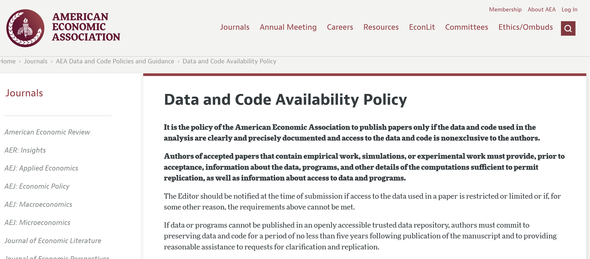

# Who am I?

## Lars Vilhuber

::::{.columns}
::: {.column width="50%"}

Executive Director of the [Labor Dynamics Institute](http://www.ilr.cornell.edu/ldi) and Senior Research Associate in the [Economics Department](http://economics.cornell.edu/) at [Cornell University](http://www.cornell.edu/), and the [American Economic Association](https://www.aeaweb.org/)’s Data Editor.

:::

::: {.column width="50%"}

:::

::::

## Data Editor of the AEA

::::{.columns}
::: {.column width="50%"}

[2791 Manuscripts and 4470 Reports, approx. 5000 authors reached.](https://aeadataeditor.github.io/aea-cumulative-summary/impacts_of_aea_data_editing.html)

:::
::: {.column width="50%"}

:::
::::
